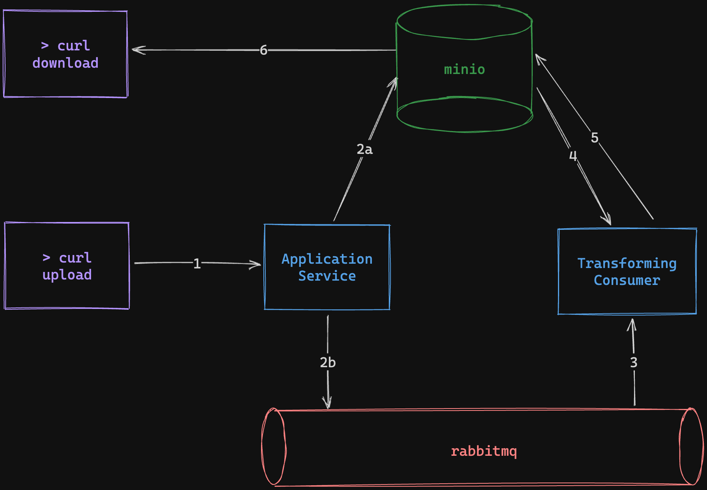

# Qui Fullstack Developer Challenge

Before beginning, you should understand:

- 3rd Party API clients
- Integration
- Queuing
- Docker

The goal of this challenge is to create a simple system that accepts image uploads, processes
them and stores them in something like S3. There already exists a `docker-compose.yml` file
that sets up `minio` and `rabbitmq`, along with an example python script that contains the
core logic to transform the image. Feel free to use all or none.

Test vectors are provided below. Make sure you understand the diagram before beginning.

If you choose not to use python for the consumer, you simply won't have test vectors. This
isn't critical. It isn't necessary to be perfect, you will have space to submit a README that
describes tradeoffs and concessions you made and why.

## The challenge

We'd like to see this input:

```sh
curl -F file=@jason.jpg http://localhost:8080/upload
curl -O http://localhost:9000/images/jason.png
ls -S -l jason* | awk '{print $5, $9}'
shasum -a256 jason*
```

produce this output:
```
❯ ls -S -l jason* | awk '{print $5, $9}'
79175 jason.jpg
7750 jason.png
❯ shasum -a256 jason*                   
cf7f4ebbc16a9b7bccc3d86318b18220ec925226d0ea2f435dfca1502a66c997  jason.jpg
0ce1665fc5ae95a4d76fc92b95318212111fa0a9604ee7e267d3c3afbf2db3d9  jason.png
```

The mechanism we'd like to see accomplish this is best described by this diagram:



## Submission checklist

- [ ] Create a new README describing:
    - [ ] Decisions, tradeoffs, and what you would change if you had time
    - [ ] How you've configured your `minio` bucket (or provide scripts)
    - [ ] The amount of time this took you
- [ ] Submit your code as a git bundle

## Getting started

You can run the tests directly, with the code provided.

```sh
cd fullstack
python3 -m venv venv
source venv/bin/activate
pip install -r requirements.pip
python consumer.py
ls -S -l jason* | awk '{print $5, $9}'
shasum -a256 jason*
```